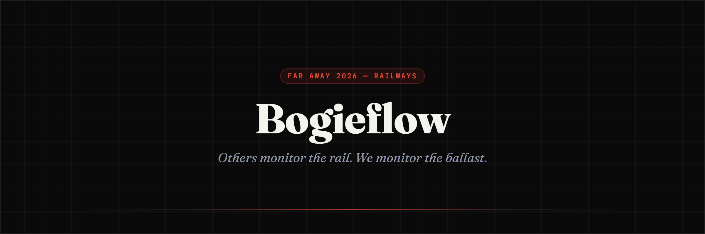
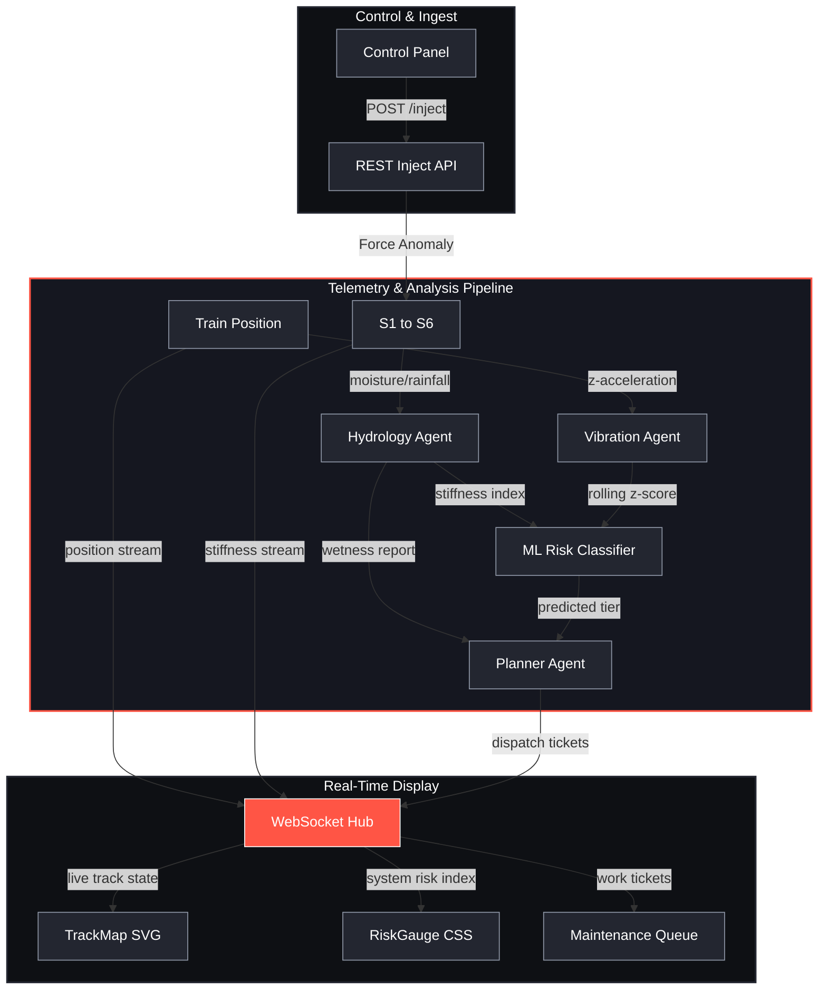

# Bogie Flow

**Others monitor the rail. We monitor the ballast.**



Climate-aware track-bed risk evaluation and agent-based telemetry fusion for railways.

[](https://github.com/Stormynubee/Faraway2026Japan/actions/workflows/ci.yml)
[](https://github.com/Stormynubee/Faraway2026Japan/blob/main/tests/)
[](https://github.com/Stormynubee/Faraway2026Japan/blob/main/src/lib/)
[](https://github.com/Stormynubee/Faraway2026Japan/releases)
[](https://github.com/Stormynubee/Faraway2026Japan/blob/main/LICENSE)
[](https://www.python.org/)
[](https://nodejs.org/)

Bogie Flow is a real-time digital twin monitoring application designed for the FAR AWAY 2026 hackathon under the Railways theme. It fuses environmental climate indicators (rainfall and soil moisture) with train bogie z-axis vibration anomalies to dynamically calculate track-bed structural risk. The application identifies track ballast degradation issues, such as mud pumping, and auto-prioritizes emergency maintenance tickets using a multi-agent workflow integrated with a machine learning classification model.

---

## System Architecture

The following diagram illustrates the flow of simulated telemetry data through the specialized agent systems, the classification model, the WebSocket hub, and the React frontend dashboard.



---

## Core Components

The application is structured into discrete layers of backend agents, machine learning services, and frontend visualization modules.

### Backend Agents
- **Hydrology Agent**: Monitors rain levels and soil moisture content on 6 track segments. Calculates effective ballast stiffness index based on climate factors to evaluate foundation dampness.
- **Vibration Agent**: Evaluates high-frequency acceleration data from the train bogie, calculating rolling z-score metrics to detect physical displacement anomalies.
- **Planner Agent**: Resolves telemetry reports from Hydrology and Vibration agents. Feeds variables to the ML risk classifier to issue maintenance work tickets.

### Machine Learning Engine
- **Gradient Boosting Classifier**: Trained using scikit-learn on physics-derived synthetic data (500 samples). Classifies track risk levels into three tiers (OK, P2, P1) based on effective stiffness and vibration anomalies.

### Frontend Dashboard
- **Interactive SVG Track Map**: Animates train movement along the S1-S6 corridor, dynamically color-coding segment risks in real time.
- **Conic Risk Gauge**: Features an animated needle with elastic overshoot transitions representing the maximum active track-bed risk index.
- **Control Panel**: Allows on-demand injection of severe monsoons or mechanical anomalies on target segments.
- **Maintenance Queue**: Displays prioritized tickets and logs of the decision path.

---

## Project Structure

```
Faraway2026Japan/
├── .github/
│   ├── issue_template/
│   │   ├── bug_report.md
│   │   └── feature_request.md
│   ├── workflows/
│   │   ├── ai-review.yml
│   │   ├── ci.yml
│   │   ├── issue-triage.yml
│   │   ├── publish-package.yml
│   │   └── stale.yml
│   ├── CODEOWNERS
│   └── pull_request_template.md
├── docs/
│   ├── PROJECT.md
│   ├── physics.md
│   ├── ws-schema.md
│   ├── SUBMISSION.md
│   └── DEMO_SCRIPT.md
├── server/
│   ├── agents/
│   │   ├── hydrology.py
│   │   ├── vibration.py
│   │   ├── risk_model.py
│   │   ├── train_risk_model.py
│   │   ├── risk_model.joblib
│   │   └── planner.py
│   ├── main.py
│   ├── simulation.py
│   └── models.py
├── src/
│   ├── components/
│   │   ├── ControlPanel.jsx
│   │   ├── MaintenanceQueue.jsx
│   │   ├── RiskGauge.jsx
│   │   └── TrackMap.jsx
│   ├── hooks/
│   │   └── useWebSocket.js
│   ├── App.jsx
│   └── index.css
├── tests/
│   ├── test_api_inject.py
│   ├── test_hydrology.py
│   ├── test_planner.py
│   ├── test_risk_model.py
│   └── test_vibration.py
├── package.json
├── pyproject.toml
├── requirements.txt
└── README.md
```

---

## API and WebSocket Specification

### REST API Endpoints

- `GET /health`: Returns service status and trained ML model parameters.
- `POST /api/inject/monsoon`: Injects rainfall and soil moisture into a segment.
- `POST /api/inject/anomaly`: Simulates physical ballast damage or bogie anomaly.

### WebSocket Messages

The WebSocket server broadcasts updates to frontend clients. Messages conform to the following schema:

| Type | Description | Key Fields |
| :--- | :--- | :--- |
| `state_snapshot` | Current state of all segments, tickets, and logs | `segments`, `train`, `tickets`, `logs` |
| `segment_update` | Telemetry details for a specific track segment | `id`, `risk_index`, `k_effective`, `color` |
| `telemetry` | Rolling bogie z-acceleration values | `segment`, `az`, `z_score`, `timestamp` |
| `ticket` | Prioritized maintenance task | `id`, `priority`, `segment`, `reason`, `model_label` |
| `agent_log` | Diagnostic log output from rule-based agents | `agent`, `message`, `timestamp` |

---

## Installation and Quick Start

### Prerequisites
- Python 3.11 or higher
- Node.js 20 or higher

### Backend Setup
1. Install Python package dependencies:
   ```bash
   pip install -r requirements.txt
   ```
2. Train the Gradient Boosting risk classifier model:
   ```bash
   python -m server.agents.train_risk_model
   ```
3. Start the FastAPI development server:
   ```bash
   python -m uvicorn server.main:app --reload --port 8000
   ```

### Frontend Setup
1. Install node dependencies:
   ```bash
   npm install
   ```
2. Start the Vite development server:
   ```bash
   npm run dev
   ```
3. Open `http://localhost:5173` in your web browser.

### Verification
Run the backend pytest suite to verify agent logic:
```bash
python -m pytest tests/ -v
```

---

## FAR AWAY 2026 Submission

| Item | Link |
| :--- | :--- |
| Theme | Railways |
| Submission guide | [docs/SUBMISSION.md](docs/SUBMISSION.md) |
| Demo script | [docs/DEMO_SCRIPT.md](docs/DEMO_SCRIPT.md) |
| Full reference | [docs/PROJECT.md](docs/PROJECT.md) |
| Demo video | [assets/demo.mp4](assets/demo.mp4) |

---

## Honesty Box

The simulation uses a physics-informed generator to emit realistic bogie vibration and weather parameters. The GradientBoosting classifier is trained on physics-derived synthetic data (500 samples) to demonstrate multi-modal risk classification. It is not an end-to-end production ML pipeline. The edge node ESP32-S3 and MPU6050 accelerometer integration strategy is fully detailed in the hardware documentation for subsequent field deployment.

---

## License

This project is licensed under the MIT License - see the LICENSE file for details.
